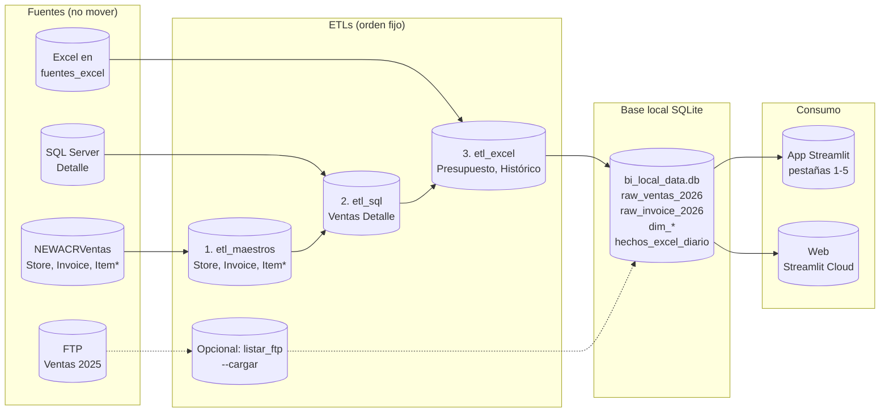
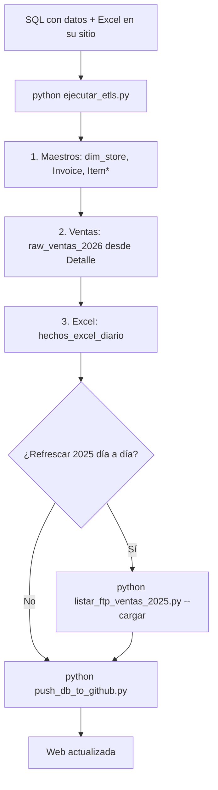

# Pipeline de datos – Ventas al Público BI

Documento para **blindar** lo construido: define el orden de carga, qué no mover y cómo agregar análisis sin romper lo existente.

---

## 1. Asunción y horario recomendado

**Asunción:** Las tablas en SQL Server (Detalle, NEWACRVentas/Invoice) **están al día a las 8:00**.  
Por tanto, el pipeline debe ejecutarse **una vez al día, después de las 8:00** (por ejemplo 8:15), para que los ETLs lean datos ya completos.

- **Recomendado:** Una sola tarea programada a las **8:15** que ejecute el pipeline completo (ETLs + opcional FTP 2025 + push a GitHub). Ver §6 más abajo.
- **Alternativa:** Si no puedes garantizar “SQL al día a las 8:00”, puedes seguir usando dos horarios (6:00 y 8:00) con `programar_tareas_etl.ps1`; la ejecución de las 8:00 será la que deje los datos al día.

---

## 2. Lógica del proceso (orden recomendado)

| Paso | Qué hacer | Comando / requisito |
|------|-----------|----------------------|
| **0. Prerrequisitos** | SQL Server (base principal y NEWACRVentas) con datos al día. Archivos Excel en su carpeta **sin mover**. | Detalle con ventas; Invoice con transacciones; Excel en `fuentes_excel` o raíz. |
| **1. ETLs principales** | Cargar maestros, ventas y presupuesto/histórico desde Excel. | `python ejecutar_etls.py` |
| **2. (Opcional) Tabla comparativo 2025** | Si quieres refrescar histórico 2025 día a día (PLAZAS) desde FTP. | `python listar_ftp_ventas_2025.py --cargar` |
| **3. Subir a la web** | Dejar la base local en GitHub para que Streamlit Cloud use datos nuevos. | `python push_db_to_github.py` |
| **4. Programación** | Con **SQL al día a las 8:00**: una ejecución después de las 8:00 (ej. 8:15) con `run_pipeline_diario.py` o `actualizar_8am.bat`. | Ver §6. |

Resumen: **SQL al día a las 8:00 → una ejecución después de las 8:00 (ej. 8:15) con run_pipeline_diario.py → ETLs + opcional FTP + push GitHub.**

---

## 3. Diagrama del flujo





---

## 4. Qué hace cada ETL (dentro de ejecutar_etls.py)

| # | Script | Tablas que escribe | Fuente |
|---|--------|--------------------|--------|
| 1 | `etl_maestros` | dim_store, dim_item_group, dim_item_family, dim_menu_item, **raw_invoice_2026** | NEWACRVentas (SQL Server) |
| 2 | `etl_sql` | **raw_ventas_2026** | Base principal, tabla Detalle |
| 3 | `etl_excel` | **hechos_excel_diario** (solo escenarios: Presupuesto_Diarizado, Historico_Diarizado, Presupuesto_Diario_2026, Historico_2025_Excel) | Excel en fuentes_excel / raíz |

**Importante:** `etl_excel` **no borra** el escenario `Historico_Diario`. Ese escenario (comparativo 2025 día a día, PLAZAS) solo se llena con:

- `python listar_ftp_ventas_2025.py --cargar`  
  o el script equivalente `etl_ftp_ventas_2025.py`.

---

## 5. Qué no mover para que no se rompa nada

- **Carpeta y nombres de Excel:** los archivos de presupuesto, transacciones, ventas, histórico, etc. deben seguir en `fuentes_excel` (o raíz) con nombres que el ETL reconozca (ej. "presupuesto", "transacciones", "2025", "dia").
- **Estructura de tablas en SQLite:** no cambiar nombres de tablas ni columnas que usa la app: `raw_ventas_2026`, `raw_invoice_2026`, `dim_store`, `hechos_excel_diario`, etc.
- **Orden de ejecución:** siempre 1) Maestros, 2) Ventas SQL, 3) Excel. No invertir ni saltar pasos.

---

## 6. Programar la actualización

**Opción A – Tres horarios (6:30, 8:00, 10:00) – local y web actualizados tres veces al día**

En la carpeta del proyecto, abrir PowerShell y ejecutar **una vez**:
```powershell
.\programar_tres_actualizaciones.ps1
```
Crea tres tareas: **BI_Andres_Actualizacion_0630** (6:30), **BI_Andres_Actualizacion_8am** (8:00), **BI_Andres_Actualizacion_10am** (10:00). Cada una ejecuta el pipeline completo (ETLs + opcional FTP + push a GitHub).

**Opción B – Una sola ejecución después de las 8:00 (ej. 8:15)**

```powershell
.\programar_actualizacion_8am.ps1
```
Crea la tarea **BI_Andres_Actualizacion_8am** a las **08:15**. Recomendado si las tablas SQL están al día a las 8:00 y basta con una actualización diaria.

**Requisitos:** PC encendida a la hora programada; `.env` con credenciales SQL; Git listo para push si quieres que la web se actualice. Para cambiar horarios: Panel de control → Herramientas administrativas → Programador de tareas.

## 7. Cómo blindar: agregar análisis sin dañar lo que hay

- **Capas claras:**  
  **Fuentes → ETLs → tablas en bi_local_data.db → app.** La app solo lee de la base local; no debe depender de rutas de Excel ni de SQL Server directamente en el dashboard.

- **Nuevos análisis:**  
  - **Opción A:** Nuevas pestañas o secciones en `app.py` que **solo lean** de las mismas tablas ya existentes (raw_ventas_2026, raw_invoice_2026, hechos_excel_diario, dim_store). No modificar las consultas ni la lógica de las pestañas 1–5.  
  - **Opción B:** Si necesitas datos nuevos, crear **nuevas tablas** (ej. `analisis_xxx`) y un **ETL nuevo** que las llene (script aparte o paso extra después de los 3 ETLs). La app entonces leería solo esas tablas nuevas en una pestaña nueva.

- **Regla práctica:** cualquier cambio que toque las pestañas 1–5 o las tablas que ellas usan debe ser revisado; lo que solo agregue pestañas o tablas nuevas queda aislado y no afecta el resto.

---

## 8. Script para correr todo cada día (manual)

Un solo comando que ejecuta el proceso paso a paso (ETLs → FTP 2025 → subida a GitHub):

```bash
python run_pipeline_diario.py
```

Puedes programarlo en el **Programador de tareas de Windows** para que se ejecute solo cada día:
- **Programa:** `python` (o la ruta completa a `python.exe`)
- **Argumentos:** `run_pipeline_diario.py`
- **Iniciar en:** la carpeta del proyecto (donde están `.env` y `bi_local_data.db`)

Opciones con variables de entorno:
- `RUN_FTP=0` → no ejecuta el paso de FTP (histórico 2025).
- `PUSH_DB_TO_GITHUB=0` → no sube la base a GitHub.

---

### Comandos manuales (alternativa)

```bash
python ejecutar_etls.py && python push_db_to_github.py
```

Con FTP 2025:

```bash
python ejecutar_etls.py && python listar_ftp_ventas_2025.py --cargar && python push_db_to_github.py
```

---

## 9. Resumen en una frase

**Primero SQL con datos y Excel sin mover → ejecutar_etls.py (maestros, ventas, Excel) → opcional listar_ftp --cargar para 2025 → push_db_to_github para la web → horarios 6 y 8 son solo para volver a correr ejecutar_etls.py.**
